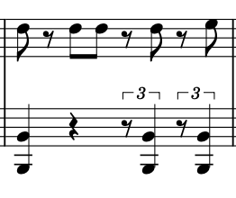

# Custom Metronome

A project idea for an ad-free metronome with customizable rhythm cues to make complex passages easier to practice.

## Motivation

Many metronome apps interrupt practice with ads that cannot be skipped. A steady beat also does not always provide enough guidance when practicing rhythms with offbeat notes, rests, or triplets.

The goal is to provide clear cues for both the beat and the notes within it, so musicians can hear exactly when to play.

## Example

This passage combines eighth notes with offbeat triplets. Keeping both rhythms aligned can be difficult when a metronome only marks the main beats. Custom rhythm cues would make the note timings easier to hear and practice.

## Goals

- Keep practice free from advertising interruptions.
- Clearly mark downbeats to help musicians stay oriented within each measure.
- Provide customizable subdivision and rhythm cues for passages like the example above.
